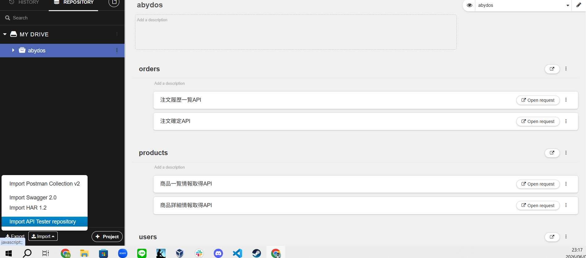
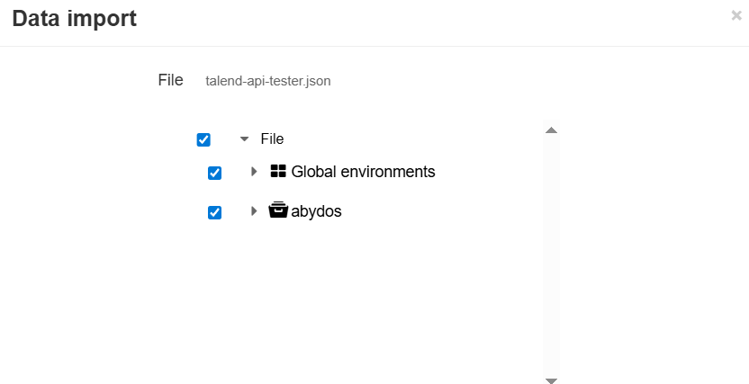
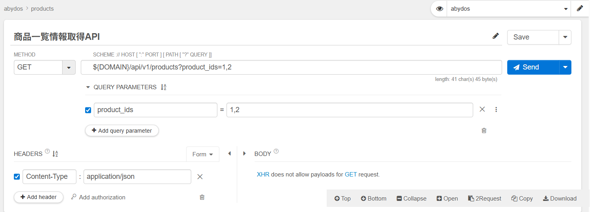

## 概要
abydosにおけるテストの方針・確認方法について記載する

## 単体試験
JUnitによるテストコードで実施する

## 内部結合試験
DynamoDBなど実際のAWS環境で動作を確認するための試験として実施する

### 仕様書
以下のテンプレートを参考に試験仕様書を作成する
https://docs.google.com/spreadsheets/d/1V6CH9s6DFDJwdQcZgCVuGproSywbN09KmVAB_bzEz8w/edit?gid=0#gid=0

#### 試験観点
- 入力観点、実行中観点、出力観点に分けて各観点を記載する
- 入力観点では、リクエストパラメータや実施前のデータ（受注やユーザーなど）の観点を定義する
- 実行中観点では、APIの処理中
- 出力観点では、レスポンスの内容やログ出力、更新後のDBのテーブル内容などの観点を定義する
- 縦列には打鍵するケースに合わせて001,002と列を増やしていく
- 観点と対応するケースに○をつける

#### 試験項目
  

### 打鍵方法
PostmanやTalend API Testerなどのテストツールを使用して確認する.  
ここではTalend API Testerでの実施手順をまとめる

1. Talend API TesterをChromeの拡張機能から選択
2. 画面左下のImportボタンを押下する

3. インポートするファイルを選択できるので、[talend-api-tester.json](talend-api-tester.json)を選択する。

4. 確認したいAPIのリクエストを実行する

