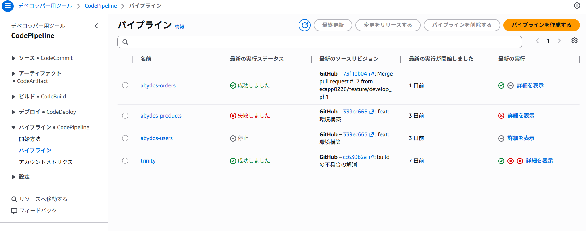
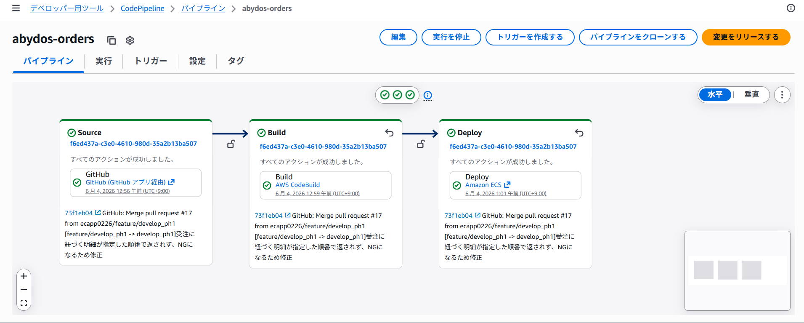
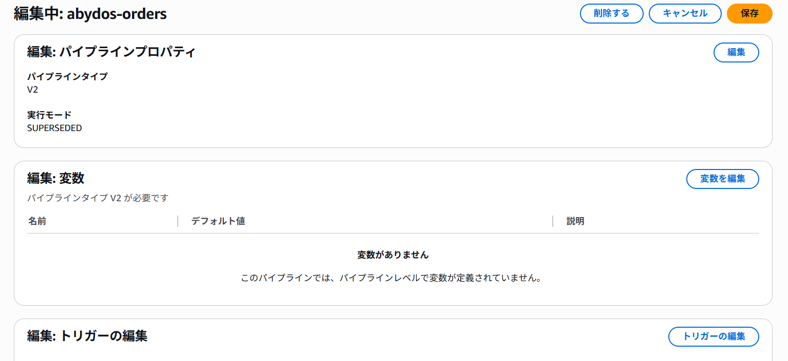
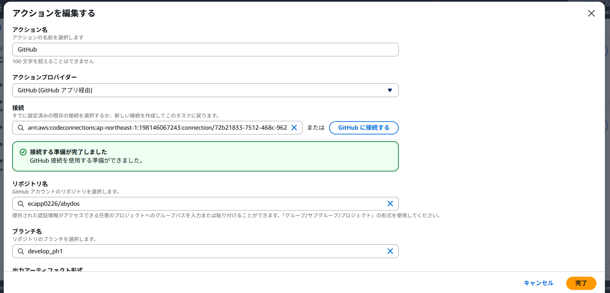
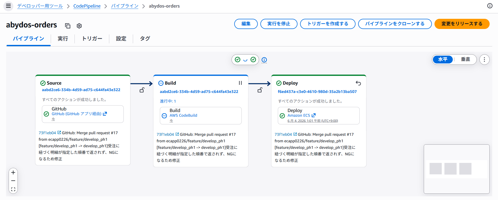

## 概要
abydosパッケージのデプロイ方法の解説用ページです。
パッケージ事に各ECSサービスにデプロイするためのパイプラインを設定しています。

| 対象のパイプライン | 対象プロダクト | 備考 |
| ------------------ | -------------- | ---- |
| abydos-orders      | orders         |      |
| abydos-products    | products       |      |
| abydos-users       | users          |      |

## 手順
トリガーによる自動デプロイはせず、手動でデプロイします。
プッシュ時に全パイプラインが起動してしまい、パッケージ事に個別でデプロイできる意味がなくなるため

| No. | 手順                                         | キャプチャ                            |
| --- | -------------------------------------------- | ------------------------------------- |
| 1   | CodePipelineを開く                           |         |
| 2   | 対象のプロダクトのパイプラインを選択         |  |
| 3   | 編集ボタンを押下                             |  |
| 4   | Sourceステージを選択し、対象のブランチを選択 |         |
| 5   | 変更をリリースするボタンを押下し、リリース   |        |

## ステージ

- Source: Githubと連携します。
- Build： gradleのビルドとビルドしたjarを使いDockerイメージをビルドし、ECRにプッシュします
- Deploy: CodeDeployは使わず、BuildステージのArtifactで生成したタスク定義を使い、ECSにデプロイします。