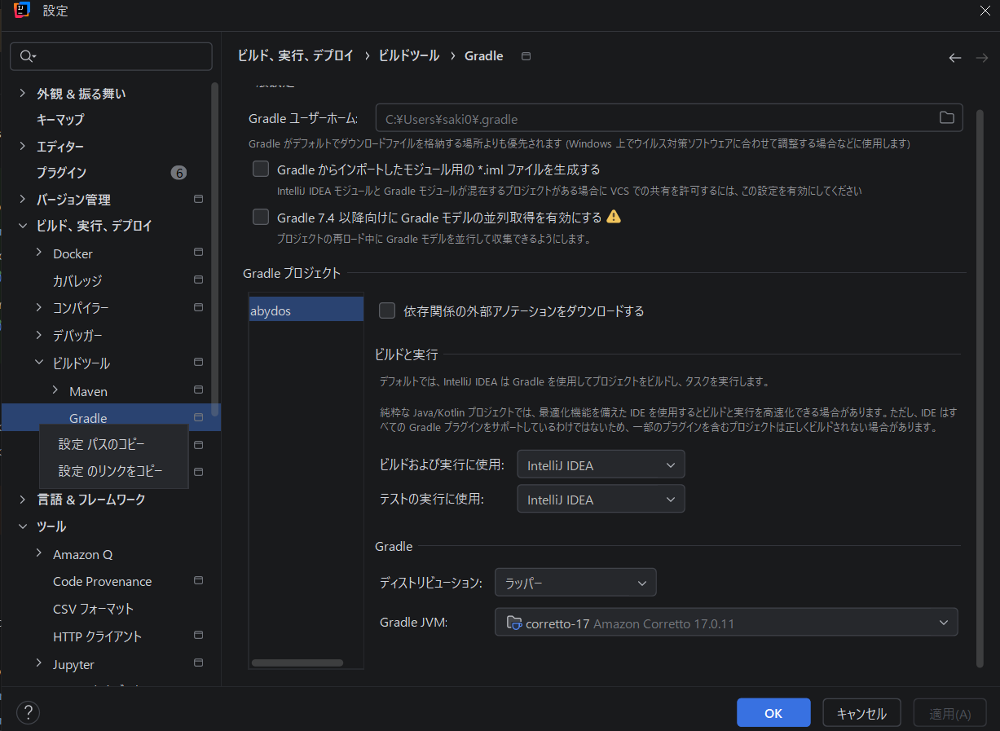
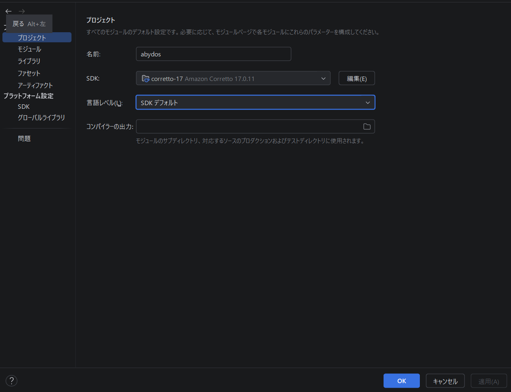
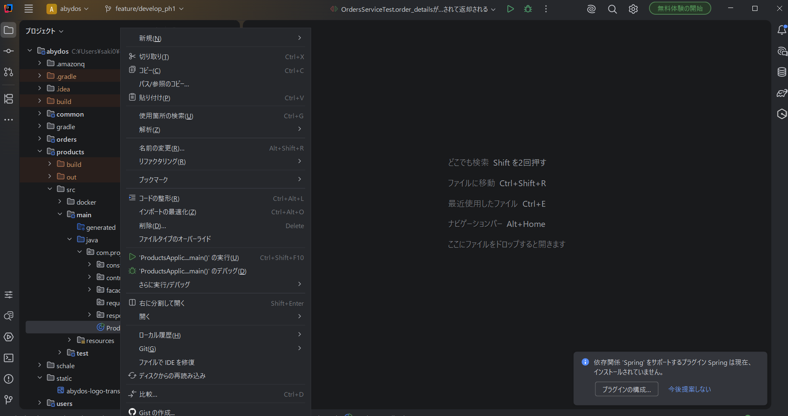
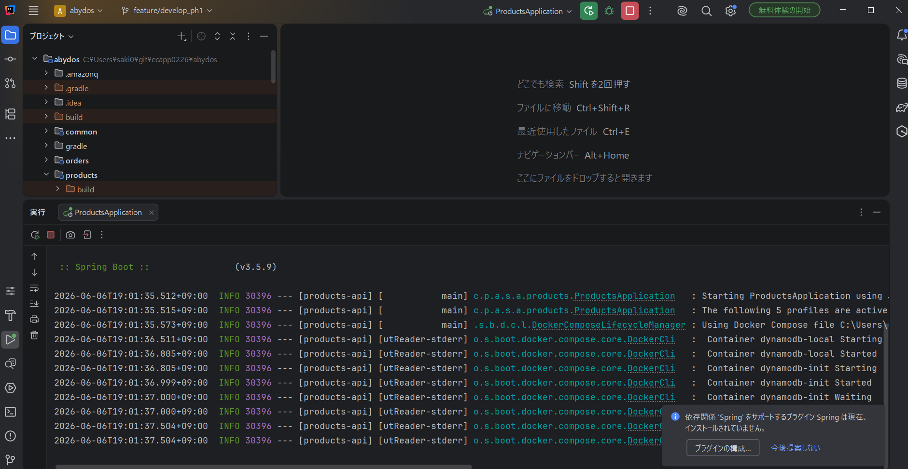

# 環境構築

## 概要
ローカル環境でアプリケーションを起動・動作確認をするための手順です

## 必要なもの
- Java17
- Gradle
- DockerおよびDocker Compose
- (任意)IntelijなどのIDE

## 前準備
- dockerデーモンを起動しておいてください
- ポート番号、8080,8081,8082を開けておいてください。

## 構築手順
### リポジトリのダウンロード
リポジトリをクローンする

```shell
git clone https://github.com/ecapp0226/abydos
```

クローンしたリポジトリ直下に移動し、サブモジュールを取り込む

```shell
git submodule update --init --recursive
```

### ビルド・起動確認

Intelijでの設定を例に記載します。

1. 設定を開き、ビルド>Gradleを選択、Gradle JVMをJava17のSDKで選択

| 項目名     | キャプチャ                     |
| ---- | ------------------------------ |
| 設定 |  |

2. ファイル>プロジェクト構造からSDKをJava17のSDKを、言語レベルは17で選択

| 項目名       | キャプチャ                                       |
| ------------ | ------------------------------------------------ |
| プロジェクト |  |

3. ビルド>プロジェクトのビルドを選択し、ビルドを実行


4. ProductsApplication.javaを右クリック、
   
| 項目名       | キャプチャ                                 |
| ------------ | ------------------------------------------ |
| jarを起動する |  |

起動に成功すれば、以下のようなログと、右上の赤色の終了アイコンが押せる状態になっている

| 項目名 | キャプチャ                               |
| ------ | ---------------------------------------- |
| 成功時 |  |
