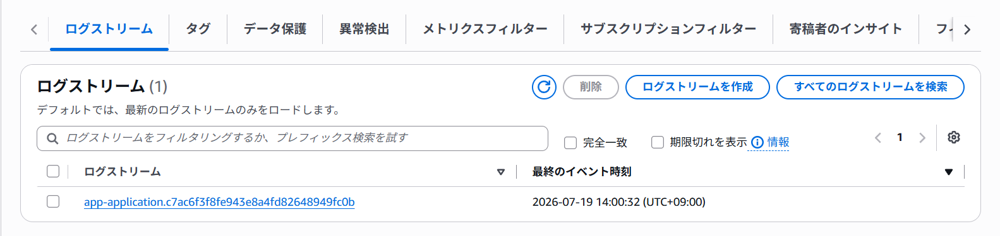

## 概要
ECSのFirelensのサイドカーから、CloudWatchのロググループに仕分けている

## ロググループについて

| ロググループ名            | フィルタ条件 | フォーマット                                                                                  | 備考 |
| ------------------------- | ------------ | --------------------------------------------------------------------------------------------- | ---- |
| abydos-xx-application.log | -            | %d{yyyy-MM-dd HH:mm:ss.SSS} [application] [%thread] %level %logger %msg%n                     |      |
| abydos-xx-warn.log        | warn         | %d{yyyy-MM-dd HH:mm:ss.SSS} [warn] [%thread] %level %logger %msg%n                            |      |
| abydos-xx-error.log       | error        | %d{yyyy-MM-dd HH:mm:ss.SSS} [error] [%thread] %level %logger %msg%n                           |      |
| abydos-xx-access.log      | access       | %h %l %u [%t{yyyy-MM-dd HH:mm:ss}] [%I] [access] "%r" %s %b "%i{Referer}" "%i{User-Agent}" %D |      |

- xxには各種ECSサービスごとのサービス名が設定される
- logback-springでフォーマットしたログをfluentbitの設定でログの仕分けをしている

    - [アプリケーションログ](https://github.com/sunaba0226/abydos/blob/develop_ph1.5/common/src/main/resources/logback-spring.xml)
    - [アクセスログ](https://github.com/sunaba0226/abydos/blob/develop_ph1.5/common/src/main/resources/conf/logback-access.xml)
    - [fluentbitの設定](https://github.com/sunaba0226/millennium/blob/develop_ph1.5/lib/abydos/constructs/ecs/taskdef/fluentbit/extra.conf)

## ログストリームについて

- app-xxx-タスクIdの形式でタスク単位でログが分割される
- 1か月でログが削除されるよう設定されている
