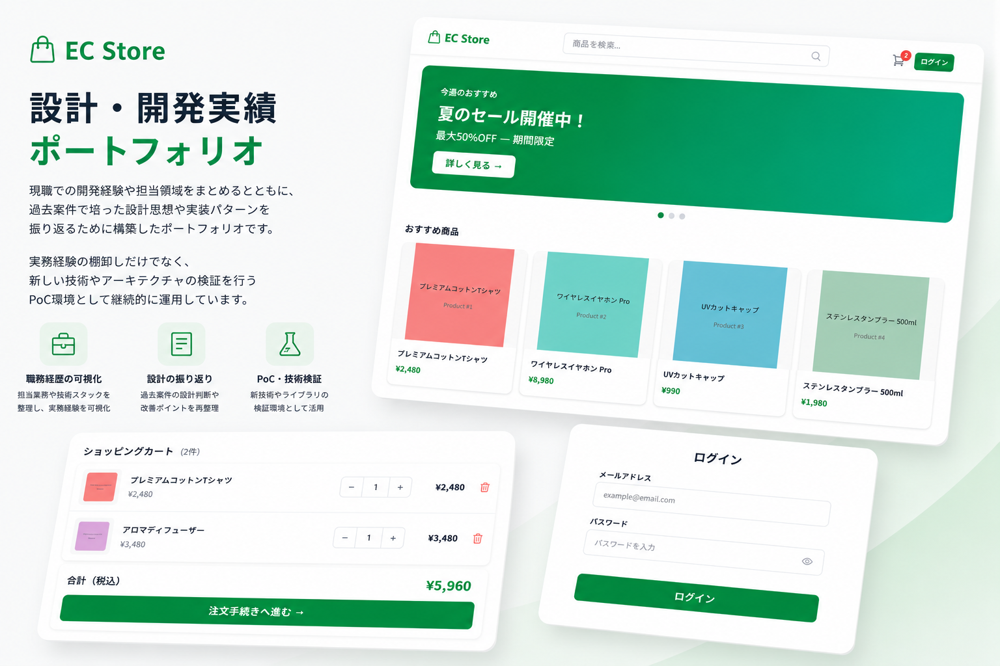
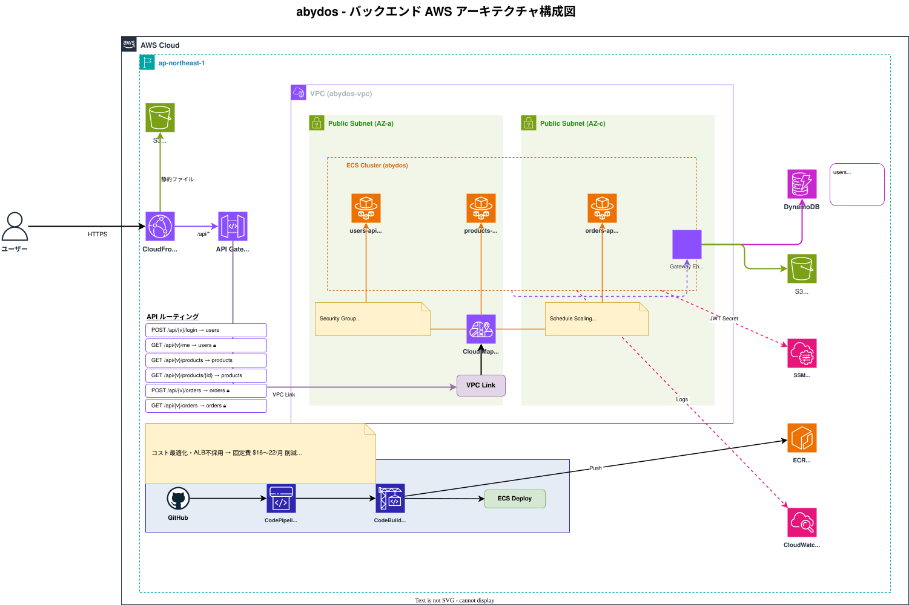

# ecapp ドキュメント

ECサイトポートフォリオの設計・開発ドキュメント集です。

## アクセス方法
以下のリンクにアクセスしてください
  
https://d2hky3wa5np1lb.cloudfront.net/

09:00~19:00の間サイトを開放しています。
  
アクセスする対象者の稼働時間を鑑みると深夜のアクセスは無駄なコストになるため、  
スケジュールに基づきスケールイン/アウトしております

## 作成背景
働き始めてから4年経過し、以下のような場面がありました。

- 自身が案件の主担当として進め、レビューはしてもらうが、最終的な設計の判断を任されること
- 過去案件でこうすればよかったのではないかと思うようになったこと
- OSのバージョンアップによる影響範囲など、実際に触ってみないと予測が立てづらいこと

現職の案件のクラス設計・実装の振り返りやPoC検証のためのサンドボックスとしてECサイトを作成しました。

## システム構成図

詳細や選定理由は[こちらのページ](abydos/001.設計/システム構成図.md)を参照  
現職のシステム構成を参考にしつつ、個人開発向けにチューニングしています。

## リポジトリ構成

| リポジトリ                                            | 内容                                     |
| ----------------------------------------------------- | ---------------------------------------- |
| [abydos](https://github.com/ecapp0226/abydos)         | バックエンド（Java / Spring Boot / AWS） |
| [trinity](https://github.com/ecapp0226/trinity)       | フロントエンド(React/ TypeScript)        |
| [millennium](https://github.com/ecapp0226/millennium) | CDK                                      |

