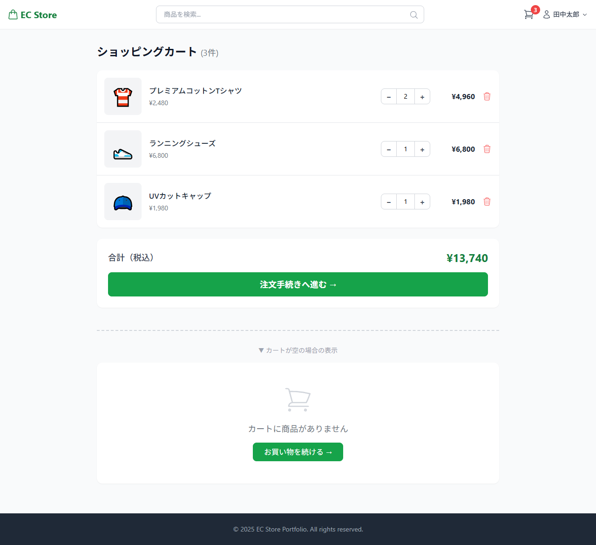
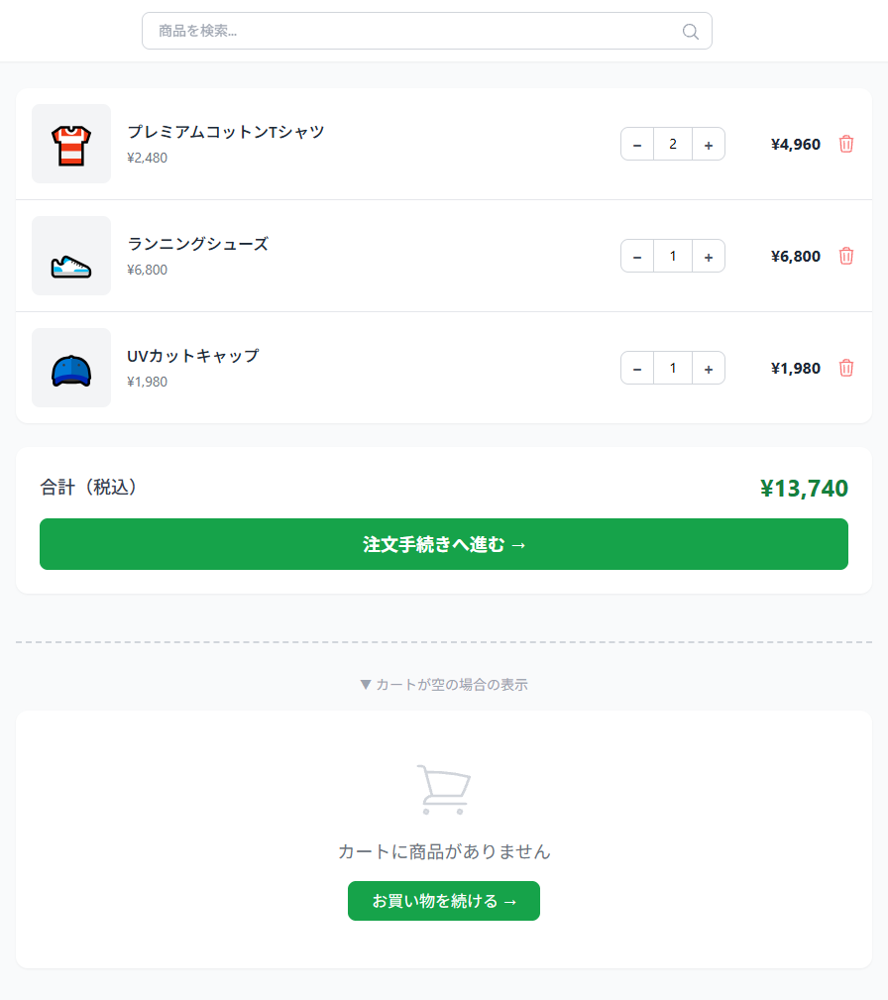

# カートページ 画面設計

## 基本情報

| 項目 | 内容 |
|------|------|
| パス | /cart |
| 認証 | 不要 |

## デザインプレビュー（全体）

## パーツ一覧

### 商品リスト

| 項目 | 内容 |
|------|------|
| デザイン |  |

| No | 要件 | 備考 |
|----|------|------|
| 1 | 「ショッピングカート（N件）」タイトルを表示する | |
| 2 | CartContextからカート内商品一覧を取得して表示する | |
| 3 | 各商品に画像（サムネイル）・商品名・単価を表示する | |
| 4 | 各商品の小計（単価×数量）を表示する | |
| 5 | −/+ボタンで数量を増減できる | 最小:1、最大:在庫数 |
| 6 | 最大数量到達時は+ボタンを無効化する | |
| 7 | 数量変更時に小計・合計が即時再計算される | |
| 8 | 🗑ボタンクリックでカートから商品を削除する | |
| 9 | 削除後にリスト・合計・ヘッダーバッジが即時更新される | |

---

### 合計・注文遷移

| 項目 | 内容 |
|------|------|
| デザイン | （上記スクショ下部） |

| No | 要件 | 備考 |
|----|------|------|
| 1 | 合計金額（税込）を表示する | |
| 2 | 「注文手続きへ進む →」クリックで注文確定画面（/checkout）へ遷移する | |
| 3 | 未ログイン時は注文手続きボタンでログイン画面へリダイレクトする | AuthGuard経由 |

---

### 空カート表示

| 項目 | 内容 |
|------|------|
| デザイン | ― |

| No | 要件 | 備考 |
|----|------|------|
| 1 | カートが空の場合は🛒アイコン+「カートに商品がありません」を表示する | |
| 2 | 「お買い物を続ける →」でTOP画面（/）へ遷移する | |

## API呼び出し

| API | メソッド | タイミング | 用途 | 失敗時 |
|-----|----------|------------|------|--------|
| なし | - | - | カート情報はCartContext（localStorage）で管理 | - |
