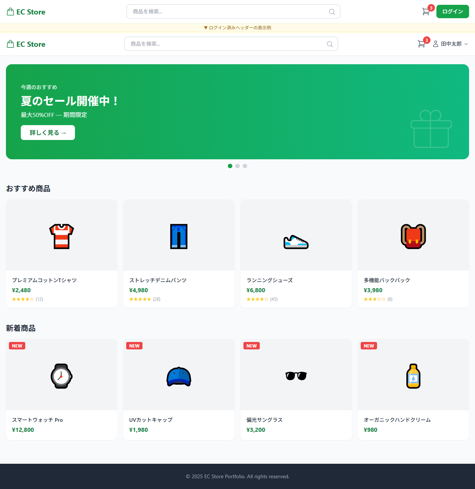
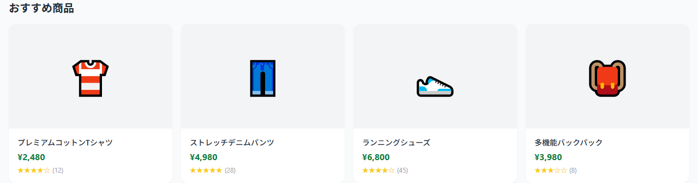
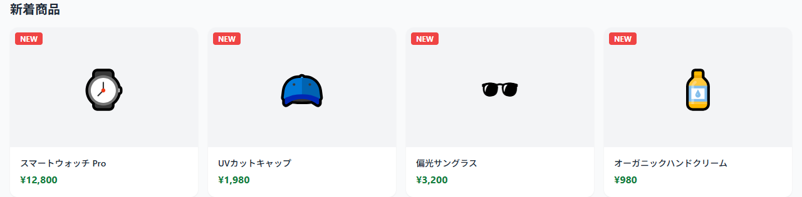

# トップページ 画面設計

## 基本情報

| 項目 | 内容 |
|------|------|
| パス | / |
| 認証 | 不要 |

## デザインプレビュー（全体）

## パーツ一覧

### ヘッダー

| 項目 | 内容 |
|------|------|
| デザイン |  |

| No | 要件 | 備考 |
|----|------|------|
| 1 | ロゴクリックでTOP画面（/）へ遷移 | |
| 2 | 検索バーを表示する | MVP では検索機能は未実装 |
| 3 | カートアイコン + バッジ（カート内商品数）を表示する | CartContextから取得 |
| 4 | 未ログイン時はログインボタンを表示する | /login へ遷移 |
| 5 | ログイン済み時はユーザー名ドロップダウンを表示する | Headless UI Menu使用 |
| 6 | ドロップダウンから注文履歴（/orders）へ遷移できる | |
| 7 | ドロップダウンからログアウトを実行できる | |

---

### ヒーローバナー

| 項目 | 内容 |
|------|------|
| デザイン |  |

| No | 要件 | 備考 |
|----|------|------|
| 1 | グラデーション背景でバナーを表示する | green → emerald |
| 2 | ラベル・タイトル・サブテキストを表示する | |
| 3 | CTAボタン（「詳しく見る →」）を表示する | |
| 4 | ページインジケーター（ドット）で複数バナーを切り替えられる | |

---

### おすすめ商品セクション

| 項目 | 内容 |
|------|------|
| デザイン |  |

| No | 要件 | 備考 |
|----|------|------|
| 1 | 「おすすめ商品」タイトルを表示する | |
| 2 | APIから商品一覧を取得して表示する | GET /api/v1/products?product_ids=1,2,3,4 |
| 3 | レスポンシブグリッドで表示する | 2列 / md:3列 / lg:4列 |
| 4 | 商品カードに画像・商品名・価格・評価（★+件数）を表示する | |
| 5 | 商品カードクリックで商品詳細画面（/products/:id）へ遷移する | |
| 6 | ローディング中はスケルトンを4件表示する | ProductCardSkeleton |

#### 状態定義

| 状態 | 表示 |
|------|------|
| loading | スケルトン4件表示 |
| success | 商品カード一覧表示 |
| empty | セクション非表示 |
| error | セクション非表示 |

---

### 新着商品セクション

| 項目 | 内容 |
|------|------|
| デザイン |  |

| No | 要件 | 備考 |
|----|------|------|
| 1 | 「新着商品」タイトルを表示する | |
| 2 | APIから新着商品一覧を取得して表示する | GET /api/v1/products?product_ids=5,6,7,8 |
| 3 | レスポンシブグリッドで表示する | 2列 / md:3列 / lg:4列 |
| 4 | 商品カードに画像・商品名・価格を表示する | 評価は非表示 |
| 5 | 各カードに「NEW」バッジを表示する | |
| 6 | 商品カードクリックで商品詳細画面（/products/:id）へ遷移する | |
| 7 | ローディング中はスケルトンを4件表示する | ProductCardSkeleton |

#### 状態定義

| 状態 | 表示 |
|------|------|
| loading | スケルトン4件表示 |
| success | 商品カード一覧表示 |
| empty | セクション非表示 |
| error | セクション非表示 |

---

### フッター

| 項目 | 内容 |
|------|------|
| デザイン |  |

| No | 要件 | 備考 |
|----|------|------|
| 1 | コピーライトを表示する | © 2025 EC Store Portfolio. All rights reserved. |

## API呼び出し

| API論理名 | エンドポイント | メソッド | タイミング | 失敗時 |
|----------|----------------|----------|------------|--------|
| 商品一覧情報取得API | /api/v1/products?product_ids=1,2,3,4 | GET | マウント時 | トルツメ |
| 商品一覧情報取得API | /api/v1/products?product_ids=5,6,7,8 | GET | マウント時 | トルツメ |
