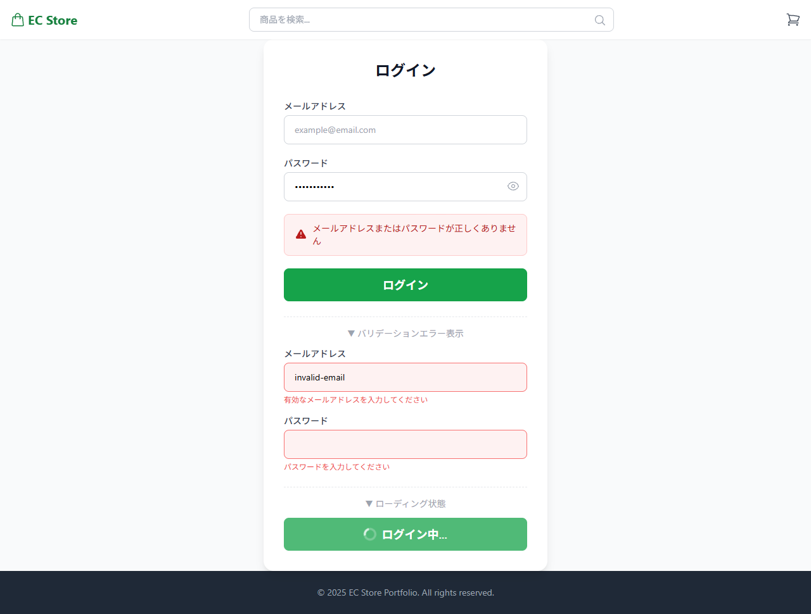
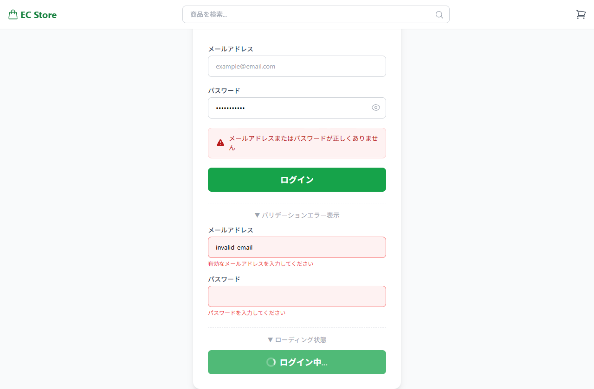

# ログインページ 画面設計

## 基本情報

| 項目 | 内容 |
|------|------|
| パス | /login |
| 認証 | 不要 |

## デザインプレビュー（全体）

## パーツ一覧

### ログインフォーム

| 項目 | 内容 |
|------|------|
| デザイン |  |

| No | 要件 | 備考 |
|----|------|------|
| 1 | 「ログイン」タイトルを表示する | |
| 2 | メールアドレス入力欄（type="email"）を表示する | |
| 3 | パスワード入力欄（type="password"）を表示する | |
| 4 | パスワード表示/非表示の切替ボタン（👁/🙈）を表示する | |
| 5 | 「ログイン」ボタンを表示する | |

---

### バリデーション

| 項目 | 内容 |
|------|------|
| デザイン | （上記スクショ内、赤枠+エラーメッセージ） |

| No | 要件 | 備考 |
|----|------|------|
| 1 | メールアドレス: 空チェック+メール形式チェックを行う | |
| 2 | パスワード: 空チェックを行う | |
| 3 | エラー時は入力欄を赤枠（border-red-400）にする | |
| 4 | 各フィールド下にバリデーションエラーメッセージを表示する | |

---

### 認証処理

| 項目 | 内容 |
|------|------|
| デザイン | ― |

| No | 要件 | 備考 |
|----|------|------|
| 1 | ログインボタンクリックで認証APIを呼び出す | POST /api/v1/login |
| 2 | API呼び出し中はローディング状態（スピナー+disabled）にする | |
| 3 | 認証成功時: AuthContextのrefreshUserを呼び出してユーザー情報を取得する | Set-CookieでJWT保存 |
| 4 | 認証成功時: 遷移元画面（state.from）またはTOP画面（/）へリダイレクトする | |
| 5 | 認証失敗時（API_LOGIN_ERR001）: 「メールアドレスまたはパスワードが正しくありません」をフォーム上部に表示する | |
| 6 | システムエラー時（500/タイムアウト等）: ServerErrorPageをインライン表示する | 「再読み込み」でログインフォームに戻る |

## API呼び出し

| API論理名 | エンドポイント | メソッド | タイミング | 失敗時 |
|----------|----------------|----------|------------|--------|
| ログインAPI | /api/v1/login | POST | ログインボタン押下時 | API_LOGIN_ERR001: エラーメッセージ表示 / その他: ServerErrorPage表示 |
