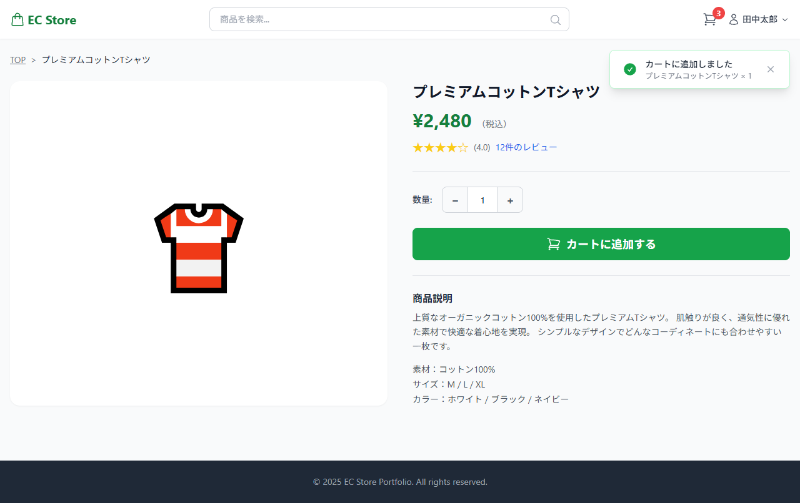
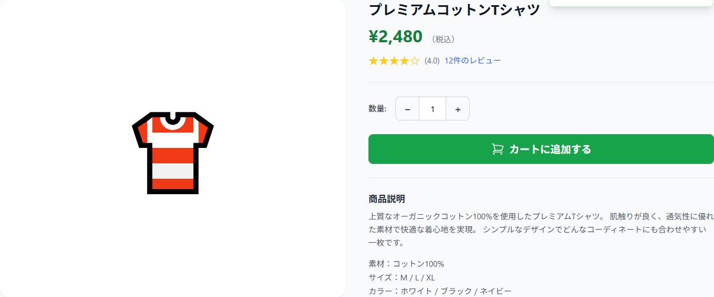
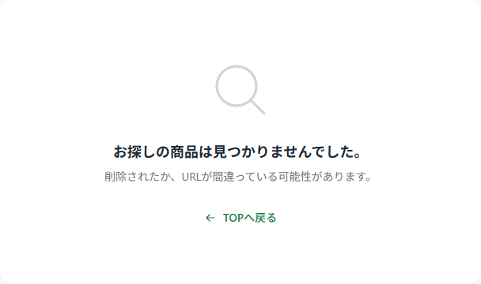
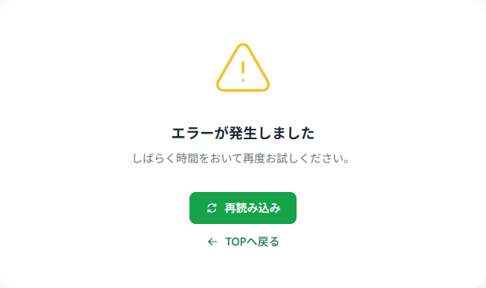

# 商品詳細ページ 画面設計

## 基本情報

| 項目 | 内容 |
|------|------|
| パス | /products/:id |
| 認証 | 不要 |

## デザインプレビュー（全体）

## パーツ一覧

### パンくずリスト

| 項目 | 内容 |
|------|------|
| デザイン |  |

| No | 要件 | 備考 |
|----|------|------|
| 1 | 「TOP > 商品名」の階層で表示する | |
| 2 | TOPリンクでトップページ（/）へ遷移する | |

---

### 商品情報エリア

| 項目 | 内容 |
|------|------|
| デザイン |  |

| No | 要件 | 備考 |
|----|------|------|
| 1 | APIから商品IDで商品詳細を取得して表示する | GET /api/v1/products/:id |
| 2 | 商品画像を表示する | S3 URL、読み込み失敗時は「No Image」 |
| 3 | 商品名を表示する | |
| 4 | 価格（税込）を表示する | |
| 5 | 評価スコア（★表示）+ レビュー件数を表示する | |
| 6 | 商品説明（description）を表示する | スペック情報もdescriptionに含む運用 |
| 7 | 数量選択（−/+ボタン）を表示する | 最小:1、最大:在庫数 |
| 8 | 最大数量到達時は+ボタンを無効化する | |
| 9 | 「カートに追加する」ボタンを表示する | |
| 10 | stock=0 または status=S/D の場合、ボタンを無効化し「在庫切れ」「販売終了」表示にする | グレーアウト |
| 11 | stock<=5 かつ stock>0 の場合、「残りわずか」ラベルを表示する | |

#### 状態定義

| 状態 | 表示 |
|------|------|
| loading | スケルトン表示 |
| success | 商品情報表示 |
| error (404) | 404エラー表示 |
| error (500) | 500エラー表示 |

---

### カート追加・トースト通知

| 項目 | 内容 |
|------|------|
| デザイン |  |

| No | 要件 | 備考 |
|----|------|------|
| 1 | カート追加ボタン押下でCartContextに追加する | バックエンドAPI不要 |
| 2 | カート内の商品種類数が上限（20件）に達している場合、追加を拒否しエラートーストを表示する | 「カートに入れられる商品は20種類までです」 |
| 3 | 追加成功時にトースト通知を表示する | 「カートに追加しました」+ 商品名×数量 |
| 4 | トーストは数秒後に自動で消える、または✕ボタンで閉じる | |
| 5 | ヘッダーのカートバッジ数が即時更新される | |
| 6 | カートはlocalStorageに永続化し、再訪問時に復元する | |

---

### エラー表示（404）

| 項目 | 内容 |
|------|------|
| デザイン |  |

| No | 要件 | 備考 |
|----|------|------|
| 1 | 🔍アイコンを大きく表示する | |
| 2 | 「お探しの商品は見つかりませんでした。」を表示する | |
| 3 | 「削除されたか、URLが間違っている可能性があります。」を表示する | |
| 4 | 「TOPへ戻る」リンクでトップページ（/）へ遷移する | |

---

### エラー表示（500）

| 項目 | 内容 |
|------|------|
| デザイン |  |

| No | 要件 | 備考 |
|----|------|------|
| 1 | ⚠️アイコンを大きく表示する | |
| 2 | 「エラーが発生しました」を表示する | |
| 3 | 「しばらく時間をおいて再度お試しください。」を表示する | |
| 4 | 「再読み込み」ボタンで現在のページをリロード（API再リクエスト）する | |
| 5 | 「TOPへ戻る」リンクでトップページ（/）へ遷移する | |

## API呼び出し

| API論理名 | エンドポイント | メソッド | タイミング | 失敗時 |
|----------|----------------|----------|------------|--------|
| 商品詳細情報取得API | /api/v1/products/:id | GET | マウント時 | エラー表示 |
