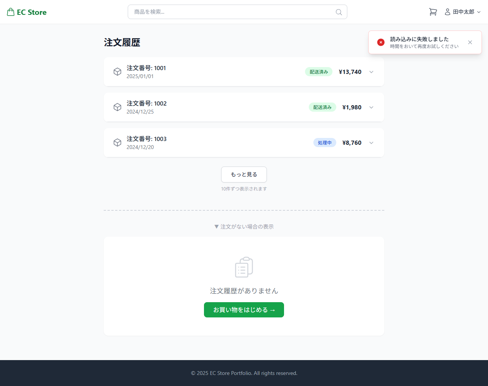
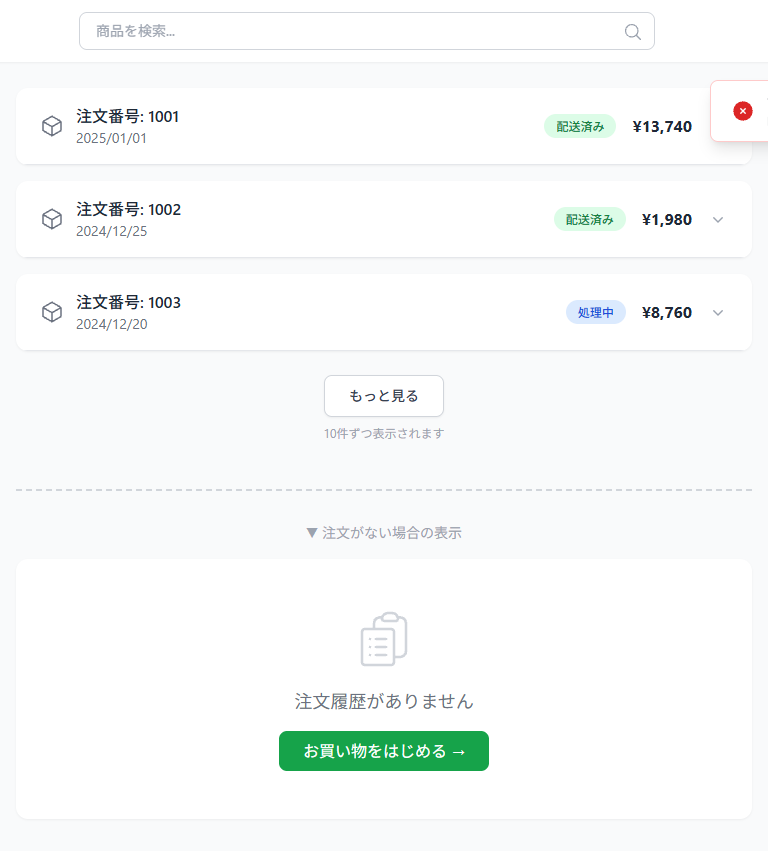

# 注文履歴ページ 画面設計

## 基本情報

| 項目 | 内容 |
|------|------|
| パス | /orders |
| 認証 | 必要 |

## デザインプレビュー（全体）

## パーツ一覧

### 注文一覧（アコーディオン）

| 項目 | 内容 |
|------|------|
| デザイン |  |

| No | 要件 | 備考 |
|----|------|------|
| 1 | 「注文履歴」タイトルを表示する | |
| 2 | APIからログインユーザーの注文一覧を取得して表示する | GET /api/v1/orders |
| 3 | 注文番号（数値）・注文日・ステータス・合計金額を表示する | 新しい注文が上 |
| 4 | 初期状態では全注文の明細を非表示（折畳）にする | |
| 5 | トグルクリックで注文明細の展開/折畳を切り替える | Headless UI Disclosure |
| 6 | 矢印アイコンの回転アニメーション（▼↔▲）を表示する | |
| 7 | 複数の注文を同時に展開可能とする | |

#### 状態定義

| 状態 | 表示 |
|------|------|
| loading | スケルトン表示 |
| success | 注文一覧表示 |
| empty | 空表示（「注文履歴がありません」） |
| error | 500エラー表示 |

---

### ステータスバッジ

| 項目 | 内容 |
|------|------|
| デザイン | （上記スクショ内） |

| No | 要件 | 備考 |
|----|------|------|
| 1 | 配送済み: 緑バッジ（bg-green-100 text-green-700）で表示する | |
| 2 | 処理中: 青バッジ（bg-blue-100 text-blue-700）で表示する | |
| 3 | 集約ルール: 全sub_ordersが「配送済み」→「配送済み」、それ以外→「処理中」 | |

---

### 注文明細（展開時）

| 項目 | 内容 |
|------|------|
| デザイン | （上記スクショ内） |

| No | 要件 | 備考 |
|----|------|------|
| 1 | 各商品の商品名・数量・小計を表示する | |
| 2 | 全商品をフラットに表示する | 店舗別グルーピングなし |

---

### ページネーション

| 項目 | 内容 |
|------|------|
| デザイン | ― |

| No | 要件 | 備考 |
|----|------|------|
| 1 | 1ページあたり10件表示する | |
| 2 | レスポンスのlastOrderIdが返却された場合「もっと見る」ボタンを表示する | |
| 3 | 「もっと見る」押下で次の10件を既存リストの下に追加読み込みする | |
| 4 | レスポンスのlastOrderIdがnullの場合「もっと見る」ボタンを非表示にする | |
| 5 | 読み込み中はボタンにローディング状態を表示する | |
| 6 | 追加読み込み失敗時は既存リストを保持しエラートーストを表示する | 「読み込みに失敗しました」+×ボタンで閉じる |

#### エラートースト（追加読み込み失敗時）

| 項目 | 内容 |
|------|------|
| デザイン |  |

| No | 要件 | 備考 |
|----|------|------|
| 1 | 画面右上にトーストを表示する | fixed top-20 right-4 |
| 2 | メッセージ「読み込みに失敗しました」を表示する | |
| 3 | サブテキスト「時間をおいて再度お試しください」を表示する | |
| 4 | ×ボタンクリックでトーストを閉じる | |
| 5 | 赤アイコン（エラー）+ 赤ボーダー（border-red-200）で表示する | |

---

### 空表示

| 項目 | 内容 |
|------|------|
| デザイン | ― |

| No | 要件 | 備考 |
|----|------|------|
| 1 | 注文がない場合は📋アイコン+「注文履歴がありません」を表示する | |
| 2 | 「お買い物をはじめる →」でTOP画面（/）へ遷移する | |

---

### エラー表示（500）

| 項目 | 内容 |
|------|------|
| デザイン | （商品詳細ページのerror_500.pngと同様） |

| No | 要件 | 備考 |
|----|------|------|
| 1 | API 500時「エラーが発生しました」を表示する | |
| 2 | 「再読み込み」ボタンでAPI再リクエストする | |
| 3 | 「TOPへ戻る」リンクでトップページ（/）へ遷移する | |

## API呼び出し

| API論理名 | エンドポイント | メソッド | タイミング | 失敗時 |
|----------|----------------|----------|------------|--------|
| 注文履歴一覧API | /api/v1/orders | GET | マウント時 | エラー表示（500ページ） |
| 注文履歴一覧API | /api/v1/orders?lastOrderId={id} | GET | 「もっと見る」押下時 | エラートースト表示 |

---

## 認証ガード

| No | 要件 | 備考 |
|----|------|------|
| 1 | 未ログイン時はログイン画面（/login）へリダイレクトする | AuthGuard |
