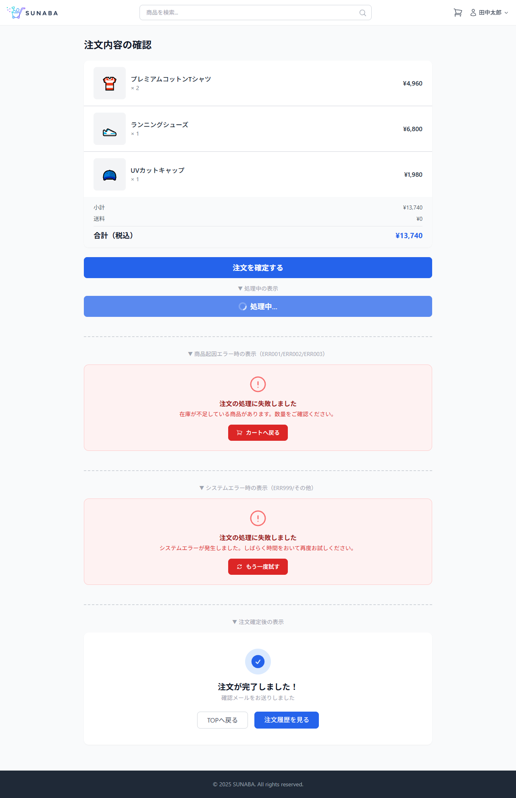
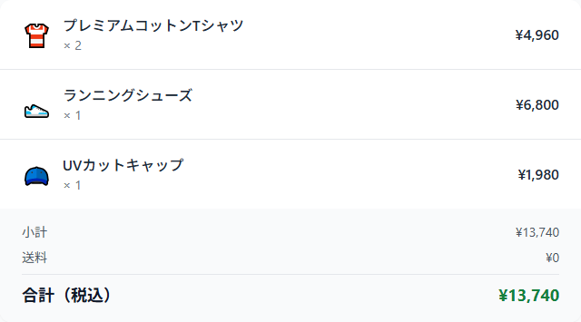
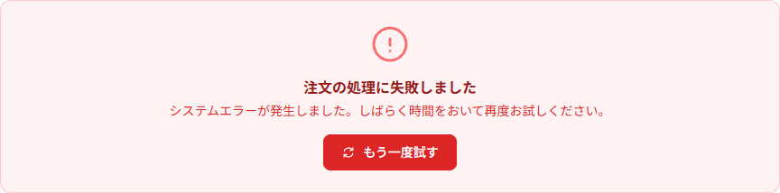

# 注文確定ページ 画面設計

## 基本情報

| 項目 | 内容 |
|------|------|
| パス | /checkout |
| 認証 | 必要 |

## デザインプレビュー（全体）

## パーツ一覧

### 注文明細

| 項目 | 内容 |
|------|------|
| デザイン |  |

| No | 要件 | 備考 |
|----|------|------|
| 1 | 「注文内容の確認」タイトルを表示する | |
| 2 | CartContextからカート内商品一覧を取得して注文明細を表示する | |
| 3 | 各商品の商品名・数量・小計を表示する | |
| 4 | 小計・送料・合計（税込）を計算して表示する | |

---

### 注文確定ボタン

| 項目 | 内容 |
|------|------|
| デザイン | （上記スクショ下部） |

| No | 要件 | 備考 |
|----|------|------|
| 1 | 「注文を確定する」ボタンクリックで注文APIを呼び出す | POST /api/v1/orders |
| 2 | API呼び出し中はローディング状態（スピナー+disabled）にする | |
| 3 | 注文成功時にCartContextをクリアする | |

---

### 注文完了表示

| 項目 | 内容 |
|------|------|
| デザイン |  |

| No | 要件 | 備考 |
|----|------|------|
| 1 | 注文完了後に✓アイコン+「注文が完了しました！」を表示する | 明細を非表示に切り替え |
| 2 | 「確認メールをお送りしました」を表示する | |
| 3 | 「TOPへ戻る」でTOP画面（/）へ遷移する | |
| 4 | 「注文履歴を見る」で注文履歴画面（/orders）へ遷移する | |

---

### 注文エラー表示（商品起因）

| 項目 | 内容 |
|------|------|
| デザイン |  |

| No | 要件 | 備考 |
|----|------|------|
| 1 | エラーカード（bg-red-50 / border-red-200）を注文明細の下に表示する | 明細は表示したまま |
| 2 | API_ORDER_ERR001: 「カート内の商品が見つかりませんでした。商品が削除された可能性があります。」を表示する | アクション:「カートへ戻る」 |
| 3 | API_ORDER_ERR002: 「カート内に現在購入できない商品が含まれています。」を表示する | アクション:「カートへ戻る」 |
| 4 | API_ORDER_ERR003: 「在庫が不足している商品があります。数量をご確認ください。」を表示する | アクション:「カートへ戻る」 |

---

### 注文エラー表示（システムエラー）

| 項目 | 内容 |
|------|------|
| デザイン |  |

| No | 要件 | 備考 |
|----|------|------|
| 1 | API_ERR999/その他: 「システムエラーが発生しました。しばらく時間をおいて再度お試しください。」を表示する | アクション:「もう一度試す」（API再実行） |

## API呼び出し

| API論理名 | エンドポイント | メソッド | タイミング | 失敗時 |
|----------|----------------|----------|------------|--------|
| 注文確定API | /api/v1/orders | POST | 注文確定ボタン押下時 | エラー表示（エラーコード別） |
