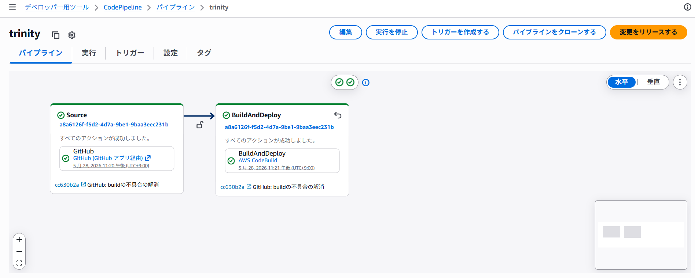
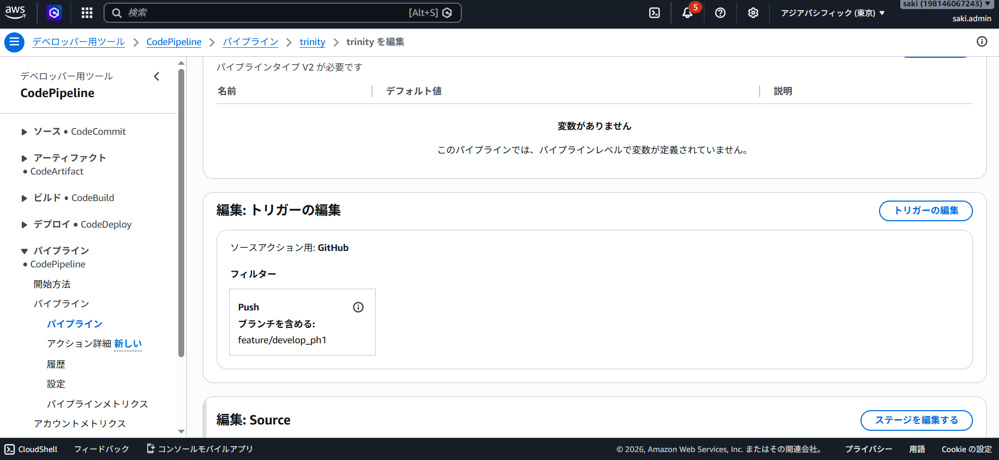
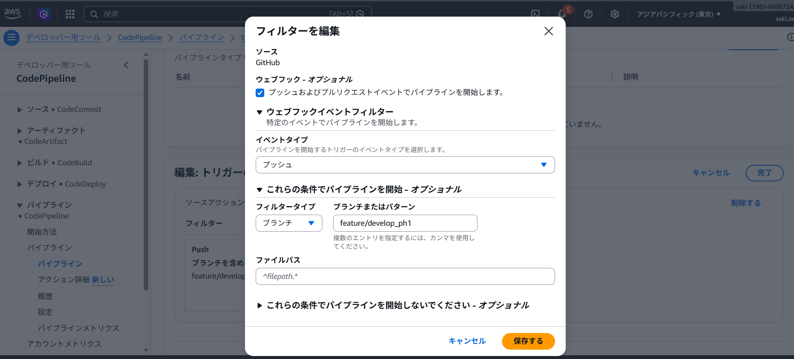
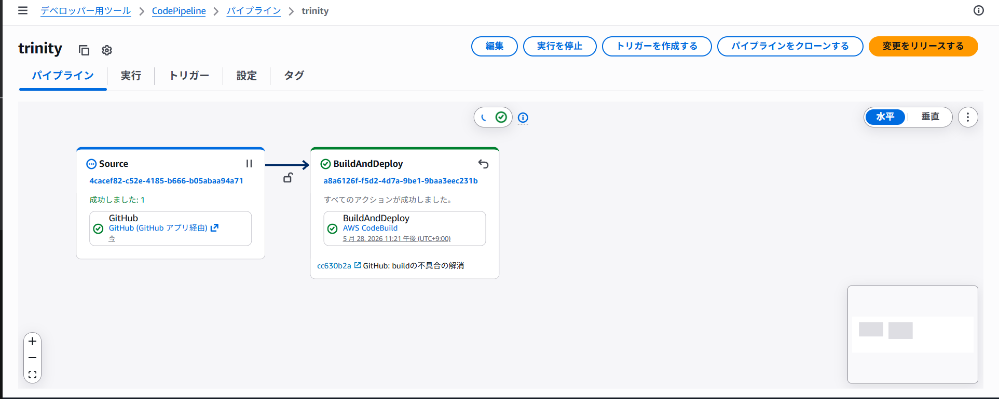

## 概要
trinityパッケージのデプロイ方法の解説用ページです。
S3 + CloudFrontにデプロイするためのパイプラインを設定しています。

| 対象のパイプライン | 対象プロダクト | 備考 |
| ------------------ | -------------- | ---- |
| trinity            | trinity        |      |

## 手順
トリガーによる自動デプロイはせず、手動でデプロイします。

| No. | 手順                                         | キャプチャ                            |
| --- | -------------------------------------------- | ------------------------------------- |
| 1   | CodePipelineを開く                           |            |
| 2   | 対象のパイプラインを選択                     | |
| 3   | 編集ボタンを押下                             |  |
| 4   | Sourceステージを選択し、対象のブランチを選択 |         |
| 5   | 変更をリリースするボタンを押下し、リリース   |        |

## ステージ

- Source: Githubと連携します。
- Build: npm run buildでプロダクションビルドを行い、成果物をS3にアップロードします。
